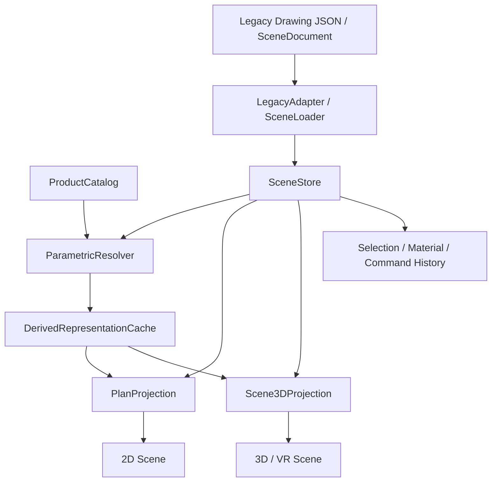

# SceneModel 与参数化产品模型设计

> 状态：目标架构草案，尚未落地实现。
>
> 目标：让 2D 彩平图、3D 预览和 VR 共享同一套场景实体与参数状态，并为家具、门窗、
> 柜体和建筑构件提供可扩展的参数化能力。
>
> 参考：当前 OCCT 项目实现，以及 `D:\KeMagic` 中的 Product / ProductView、参数类型、
> 公式缓存、参数化几何与 Command/History 机制。

---

## 1. 为什么要同时改 SceneModel 和参数化模型

当前问题不只是“3D 模型是 Box”。更根本的问题是数据与渲染结构没有形成稳定的领域模型：

- `App.loadData()` 从 `GeometryService` 取得 `{ outline, rooms, doorWindows, softlists }`，
  再分别深拷贝给 2D 和 3D。
- 两个视图各自创建 mesh，通过 `roomIndex`、`userData.type`、`softlistId` 等临时字段识别对象。
- 选择、材质和运行时拖入模型的状态主要存在于 mesh 或各自的选择器里，不是场景数据的一部分。
- 软装 2D 几何来自 `parsed_dxf`，3D 则由 footprint 挤出固定高度的 Box；二者虽然描述同一件
  软装，但没有共同的实体和稳定 ID。
- `TypeId_序号` 与数组顺序、特定一批 `parsed_dxf` 文件绑定，编辑、删除、插入实例后不稳定。
- 门窗显示轮廓与 CSG 外扩轮廓使用平行数组，通过下标隐式关联。
- 运行时拖入的模型直接创建 Three.js 基本体，没有可持久化的产品定义和参数。

所以不能只给 Box 增加 `width/height/depth`。如果参数仍只存在于某个 3D mesh 上，2D、3D、
保存、撤销和材质仍然会继续分叉。

本设计将问题拆成两层：

1. **SceneModel**：项目中的实体、实例状态和实体关系，是单一真相源。
2. **Parametric Product Model**：定义一种产品有哪些参数、约束，以及如何由参数生成表示。

---

## 2. 当前实现盘点

### 2.1 当前实际渲染的实体

| 实体 | 来源 | 2D | 3D | 当前几何本质 |
|---|---|:--:|:--:|---|
| room | `final_room_list` | 房间面、选择 | CSG 减体、地板 | footprint |
| wall | 房间边派生 | — | 直/弧墙段 | 房间边 + 高度 |
| floor | 房间派生 | — | ✓ | footprint |
| outline | 房间并集派生 | 底板 | 外壳 | `{outer, holes}` |
| door | `door_list` | 挖洞 | 显示、挖洞 | footprint + height |
| window | `window_list` | 挖洞 | 显示、挖洞 | footprint + base + height |
| softlist | `soft_list` + `parsed_dxf` | DXF 符号 | footprint Box | symbol + area |
| freestyle | `soft_list` 内联点 | ✓ | 可降级为占位体 | symbol |
| placedModel | 运行时拖拽 | — | Three.js 基本体 | runtime mesh |

`final_space_dim_list` 已被解析为 `Dim_Points`，但当前没有渲染器消费。原始 JSON 中梁、柱、
平台、壁龛、窗台、承重墙、管线和机电点位等列表尚未接入。

### 2.2 与旧版设计文档相比的现状变化

软装已经不再“只活在 2D”。当前 `RoomRenderer` 会调用 `Softlist3DFactory.createBoxes()`，
用软装世界坐标 footprint 挤出固定高度占位体。但这只是 3D 降级表示，还不是统一实体或参数化产品。

### 2.3 当前结构与目标结构的差距

| 能力 | 当前实现 | 目标 |
|---|---|---|
| 场景索引 | 多个分类数组 | `Map<EntityId, Entity>` |
| 实体 ID | 数组下标、`TypeId_序号` | 持久化 UUID |
| 2D/3D 数据 | 分别深拷贝 | 订阅同一个 SceneStore |
| 几何 | 渲染器分别解释 | 统一表示协议 |
| 软装 | 2D symbol、3D Box 分离 | 一个 component entity 的多表示 |
| 参数 | 零散尺寸和 mesh scale | 产品定义 + 实例参数 |
| 参数联动 | 无 | 依赖图、公式求值和约束校验 |
| 更新 | 直接修改 mesh | Command 修改模型，View 增量刷新 |
| 撤销重做 | 仅局部交互 | SceneModel 命令历史 |

---

## 3. 从 KeMagic 吸收什么

`D:\KeMagic` 已经实现过一套参数化产品框架，其中以下思想适合复用。

### 3.1 Product 与 ProductView 分离

KeMagic 用 `Solution -> ProductGroup -> Product` 表示稳定的产品树，用 `ProductView` 将产品投影成
2D 或 3D 对象。数据节点有稳定 `key`，View 只负责表现，修改 Product 后通过事件刷新 View。

本项目采用同样的职责边界，但不要求 2D/3D 共用 mesh：

```text
SceneStore / Entity                视图无关，单一真相源
        │
        ├── PlanProjection         生成或更新 2D 对象
        ├── Scene3DProjection      生成或更新 3D 对象
        └── VRProjection           复用 3D 表示和交互状态
```

每个渲染对象只保存反向引用：

```js
mesh.userData = {
  entityId: '01J...',
  representationId: 'body-3d',
  partId: 'left-panel'
};
```

### 3.2 参数需要“数据类型”和“取值模式”两个维度

KeMagic 的 `ParamData` 不只区分 number/string/boolean，还区分固定值、区间、选项、公式和引用，
并支持参数可见性、选项可见性、父级/同级引用。这是参数编辑器和参数联动的基础。

本项目保留这个思想，但缩减为明确、可验证的 Schema：

- 数据类型：`number | integer | string | boolean | material | asset`；
- 取值模式：`fixed | free | range | options | formula | reference`；
- 输入模式：`manual | select | formula | imported`；
- 可选：`min/max/step/options/visibleWhen/enabledWhen`；
- 参数使用稳定 `code` 参与公式，显示名称 `label` 可以改名。

### 3.3 公式结果缓存与作用域

KeMagic 的新链路不再让渲染层现场解析完整参数关系，而是读取 `__formulaCache__`；缓存键同时区分
`parent` 与 `self` 作用域。参数化 Shape、Line、ExtrudePath 在创建或 `forceUpdate()` 时把公式值
转换成顶点和路径。

本项目采用类似的“先求值、后建模”流程：

```text
参数输入
  → 参数校验
  → 依赖图 / 公式求值
  → ResolvedParameterSet
  → 几何 Recipe 求值
  → 2D / 3D 表示
```

公式缓存是派生数据，不是权威数据。缓存必须带输入哈希和求值器版本，失效时可以完整重算。

### 3.4 参数变化后重建几何

KeMagic 的参数化 Shape、Line、ExtrudePath 都实现了 `forceUpdate()`，参数变化后重算 path、holes、
extrudePath，再替换 BufferGeometry。这个刷新边界应保留，但要改成按脏标记精确更新。

### 3.5 Command 与 History

KeMagic 中 `EditProductCommand`、`MultiEditProductCommand` 和 `History` 让数据修改天然支持撤销、重做，
连续拖动还可以合并为一个命令。本项目中的参数修改、移动、旋转、材质替换、增删实体都应走命令层，
而不是直接改 mesh。

### 3.6 不直接照搬的部分

- 不用逗号字符串保存坐标和旋转，统一使用数值数组或对象。
- 不把产品参数定义、实例当前值、公式结果和渲染缓存混在同一个对象中。
- 不通过 `new Function` 或 `eval` 执行公式。
- 不用可修改的中文显示名作为参数唯一标识。
- 不依赖兄弟节点别名做隐式全局耦合；跨实体引用必须是显式关系。
- 不保留新旧两套公式引擎同时解释同一份数据。

---

## 4. 设计原则

1. **SceneModel 是项目实例的单一真相源。**
2. **ProductDefinition 定义“这一类产品如何变化”，ComponentInstance 保存“这一件是什么状态”。**
3. **参数是源数据，三角网格、footprint、包围盒和公式结果都是派生数据。**
4. **2D/3D 不共享 mesh，只共享 entity、参数、材质和选择状态。**
5. **所有实体使用持久化 UUID；数组顺序和 Three.js UUID 不能作为业务 ID。**
6. **项目单位统一为 mm，右手坐标系，XY 为地面，Z 向上。**
7. **组件几何在局部坐标生成，再由 transform 放置到世界坐标。**
8. **尺寸变化优先重建语义部件，不默认使用整体 `mesh.scale`。**
9. **产品定义必须版本化，旧项目始终能引用创建时的产品版本。**
10. **任何派生缓存都必须可丢弃、可重建、可检测失效。**

---

## 5. 总体分层



| 层 | 责任 |
|---|---|
| `SceneDocument` | 可序列化的项目数据 |
| `SceneStore` | 内存实体索引、变更事务、订阅和查询 |
| `ProductCatalog` | 按 `productId + version` 提供产品定义 |
| `ParametricResolver` | 参数合并、公式求值、约束校验、依赖追踪 |
| `GeometryGenerator` | 根据 Recipe 生成统一表示 |
| `DerivedRepresentationCache` | 缓存公式结果、2D/3D 几何、包围盒和碰撞体 |
| `Projection` | 把实体表示投影成各视图对象 |
| `CommandHistory` | 数据修改、撤销、重做和连续操作合并 |

---

## 6. SceneDocument：可持久化项目结构

JSON 中使用普通对象和数组；加载后由 `SceneStore` 转换成 `Map` 索引。

```ts
interface SceneDocument {
  schemaVersion: '2.0';
  projectId: string;
  units: 'mm';
  coordinateSystem: {
    handedness: 'right';
    upAxis: 'Z';
    floorPlane: 'XY';
  };

  defaults: {
    wallHeight: number;
    wallThickness: number;
  };

  levels: Level[];
  entities: Entity[];

  catalogLocks: Array<{
    productId: string;
    version: string;
    definitionHash: string;
  }>;

  metadata?: {
    createdAt?: string;
    updatedAt?: string;
    source?: string;
  };
}

interface Level {
  id: string;
  name: string;
  elevation: number;
  height: number;
}
```

`catalogLocks` 用来锁定产品版本和定义哈希，避免产品库更新后旧项目无提示地改变几何。

---

## 7. 统一 Entity

### 7.1 通用结构

```ts
type EntityKind =
  | 'room'
  | 'wall'
  | 'floor'
  | 'outline'
  | 'door'
  | 'window'
  | 'component'
  | 'dimension'
  | 'beam'
  | 'pillar'
  | 'platform'
  | 'niche'
  | 'sill'
  | 'mep';

interface Entity {
  id: string;                         // 持久化 UUID
  kind: EntityKind;
  name?: string;
  levelId?: string;
  source: 'imported' | 'derived' | 'runtime';
  revision: number;

  transform?: Transform;
  geometry?: SourceGeometry;          // 非参数化实体的权威几何
  building?: BuildingElementData;     // 墙等建筑构件的参数化权威输入
  component?: ComponentInstance;      // 参数化或资产型产品实例
  relations?: EntityRelations;
  appearance?: Appearance;

  visible?: boolean;
  locked?: boolean;

  legacy?: {
    typeId?: string;
    listName?: string;
    sourceIndex?: number;
    dxfKey?: string;
  };
}

interface Transform {
  position: [number, number, number];
  rotation: [number, number, number, number]; // quaternion: x,y,z,w
  scale: [number, number, number];             // 正常参数化组件保持 [1,1,1]
}

type BuildingElementData = {
  type: 'wall';
  path: Point2[];                     // 墙中心路径，不是墙体面
  thickness: number;
  height: number;
  base: number;
};

interface EntityRelations {
  parentId?: string;
  childIds?: string[];
  host?: {
    entityId: string;
    type: 'wall' | 'floor' | 'ceiling' | 'component';
    placement?: {
      distance: number;               // 沿宿主路径的位置
      elevation?: number;             // 相对宿主基准面的高度
      lateralOffset?: number;
      flip?: boolean;
    };
  };
  roomId?: string;
}

interface Appearance {
  materialBindings?: Record<string, MaterialRef>;
  colorOverride?: string;
  opacity?: number;
}
```

`selected` 不写入可持久化 Entity。选择是编辑会话状态，由 `SelectionStore.selectedEntityIds` 管理；
`visible`、`locked` 和材质属于项目状态，可以持久化。

### 7.2 表示协议：持久化源数据与运行时派生数据

2D 面、2D 符号、标注、静态 3D 资产和参数化生成的 3D 网格必须使用同一套表示协议，但要区分
“可持久化的权威源数据”和“可丢弃重建的派生数据”。Three.js 的 `Object3D`、`BufferGeometry`
和 UUID 不进入项目文件。

```ts
interface AreaRepresentation {
  type: 'area';
  footprint: Point2[];
  holes?: Point2[][];
  base: number;
  height: number;
}

interface SymbolRepresentation {
  type: 'symbol';
  polylines: Point2[][];
  fills?: Point2[][];
}

interface AnnotationRepresentation {
  type: 'annotation';
  lines: Point2[][];
  labels?: Array<{ text: string; at: Point2; rotation?: number }>;
}

interface Asset3DRepresentation {
  type: 'asset3d';
  assetId: string;
  nodeName?: string;
}

interface Mesh3DRepresentation {
  type: 'mesh3d';
  geometryKey: string;                // 指向运行时 GeometryCache
  parts: Array<{
    partId: string;                   // 稳定语义 ID，如 left-side / door-1
    materialSlot?: string;
  }>;
}

interface Point2 {
  x: number;
  y: number;
  bulge?: number; // 到下一点的弧；0 或缺省表示直线
}

type Point3 = [number, number, number];

type SourceGeometry = {
  representations: Array<
    | AreaRepresentation
    | SymbolRepresentation
    | AnnotationRepresentation
    | Asset3DRepresentation
  >;
};

type DerivedGeometry = {
  representations: Array<
    | AreaRepresentation
    | SymbolRepresentation
    | AnnotationRepresentation
    | Mesh3DRepresentation
  >;
  collision?: AreaRepresentation | Mesh3DRepresentation;
};
```

一个组件可以同时拥有：

- 3D 静态资产用的 `asset3d`，或参数化生成后的 `mesh3d`；
- 简单挤出体和碰撞体用的 `area`；
- 2D 用的 `symbol`；
- 尺寸或安装说明用的 `annotation`。

参数化组件的 `DerivedGeometry` 由 Product Recipe 生成，只放入运行时缓存，不重复写回
`Entity.geometry`，避免出现“参数和 footprint 谁才是源数据”的双真相问题。静态导入的 GLB/GLTF 则通过
`Asset3DRepresentation` 保存资产引用，而不是把网格顶点塞进场景 JSON。

---

## 8. ProductDefinition 与 ComponentInstance

### 8.1 实例只保存引用和覆盖值

```ts
interface ComponentInstance {
  productRef: {
    productId: string;
    version: string;
  };

  parameterValues: Record<string, ParameterValue>;
  materialOverrides?: Record<string, MaterialRef>;
  variantId?: string;
}
```

示例：

```json
{
  "id": "01J_COMPONENT_001",
  "kind": "component",
  "levelId": "level-1",
  "source": "imported",
  "revision": 1,
  "transform": {
    "position": [3303.86, 5524.39, 0],
    "rotation": [0, 0, 0, 1],
    "scale": [1, 1, 1]
  },
  "component": {
    "productRef": {
      "productId": "cabinet.base",
      "version": "2.1.0"
    },
    "parameterValues": {
      "width": 800,
      "depth": 600,
      "height": 850,
      "doorCount": 2,
      "hasToeKick": true
    },
    "materialOverrides": {
      "body": "material.white-matte",
      "countertop": "material.quartz-gray"
    }
  },
  "legacy": {
    "typeId": "20cd02",
    "sourceIndex": 0,
    "dxfKey": "20cd02_0"
  }
}
```

### 8.2 产品定义描述能力，不描述摆放

```ts
interface ProductDefinition {
  schemaVersion: '1.0';
  productId: string;
  version: string;
  name: string;
  category: string;
  units: 'mm';

  anchor: {
    origin: 'center' | 'bottom-center' | 'back-bottom-center' | Point3;
    forwardAxis: '+X' | '-X' | '+Y' | '-Y';
    upAxis: '+Z';
  };

  parameters: ParameterDefinition[];
  constraints?: ConstraintDefinition[];
  materialSlots?: Record<string, MaterialSlotDefinition>;
  geometry: GeometryRecipe;
  representations?: ProductRepresentationDefinition;
  metadata?: Record<string, unknown>;
}
```

产品定义和实例分开以后，同一个柜体定义可以被上百个实例复用；实例只保存与默认值不同的参数覆盖，
也可以在保存时选择展开全部值以便审计。

---

## 9. 参数 Schema

### 9.1 参数定义

```ts
type ParameterDataType =
  | 'number'
  | 'integer'
  | 'string'
  | 'boolean'
  | 'material'
  | 'asset';

type ParameterValueMode =
  | 'fixed'
  | 'free'
  | 'range'
  | 'options'
  | 'formula'
  | 'reference';

interface ParameterDefinition {
  id: string;                    // 定义内稳定 UUID
  code: string;                  // 公式和实例覆盖使用，发布后不可随意修改
  label: string;                 // UI 显示名，可修改、可国际化
  dataType: ParameterDataType;
  valueMode: ParameterValueMode;
  unit?: 'mm' | 'm' | 'm2' | 'deg' | 'count';

  defaultValue?: ParameterValue;
  defaultExpression?: Expression;

  min?: number | Expression;
  max?: number | Expression;
  step?: number;

  options?: ParameterOption[];
  visibleWhen?: Expression;
  enabledWhen?: Expression;

  effects?: Array<
    'geometry' | 'transform' | 'material' | 'visibility' | 'asset' | 'annotation'
  >;

  editor?: {
    group?: string;
    order?: number;
    widget?: 'input' | 'slider' | 'select' | 'switch' | 'material-picker';
    description?: string;
  };
}

interface ParameterOption {
  id: string;
  label: string;
  value: ParameterValue | Expression;
  visibleWhen?: Expression;
  assetRef?: string;
  thumbnail?: string;
}

type ParameterValue = number | string | boolean;
```

与 KeMagic 一样，区间边界、选项可见性和当前值都允许依赖公式；但定义必须明确数据类型和影响范围，
方便校验和增量刷新。

### 9.2 柜体参数示例

```json
{
  "productId": "cabinet.base",
  "version": "2.1.0",
  "name": "双门地柜",
  "category": "cabinet",
  "units": "mm",
  "anchor": {
    "origin": "back-bottom-center",
    "forwardAxis": "+Y",
    "upAxis": "+Z"
  },
  "parameters": [
    {
      "id": "param-width",
      "code": "width",
      "label": "宽度",
      "dataType": "number",
      "valueMode": "range",
      "unit": "mm",
      "defaultValue": 800,
      "min": 400,
      "max": 1200,
      "step": 10,
      "effects": ["geometry", "annotation"]
    },
    {
      "id": "param-panel-thickness",
      "code": "panelThickness",
      "label": "板厚",
      "dataType": "number",
      "valueMode": "options",
      "unit": "mm",
      "defaultValue": 18,
      "options": [
        { "id": "pt-15", "label": "15 mm", "value": 15 },
        { "id": "pt-18", "label": "18 mm", "value": 18 },
        { "id": "pt-25", "label": "25 mm", "value": 25 }
      ],
      "effects": ["geometry"]
    },
    {
      "id": "param-inner-width",
      "code": "innerWidth",
      "label": "柜内净宽",
      "dataType": "number",
      "valueMode": "formula",
      "defaultExpression": {
        "op": "subtract",
        "args": [
          { "ref": "width" },
          {
            "op": "multiply",
            "args": [{ "ref": "panelThickness" }, 2]
          }
        ]
      },
      "effects": ["geometry"]
    }
  ]
}
```

---

## 10. 公式、依赖和约束

### 10.1 表达式格式

权威存储建议使用可验证 AST，不保存可执行 JavaScript：

```ts
type Expression =
  | number
  | string
  | boolean
  | { ref: string; scope?: 'self' | 'parent' }
  | {
      op:
        | 'add' | 'subtract' | 'multiply' | 'divide' | 'mod'
        | 'min' | 'max' | 'clamp'
        | 'eq' | 'ne' | 'gt' | 'gte' | 'lt' | 'lte'
        | 'and' | 'or' | 'not' | 'if'
        | 'round' | 'floor' | 'ceil' | 'abs';
      args: Expression[];
    };
```

UI 可以显示为 `$width - $panelThickness * 2`，保存时编译为 AST。这样能够：

- 收集依赖；
- 检测循环引用；
- 校验类型和单位；
- 在浏览器、Worker 或服务端得到一致结果；
- 避免任意代码执行。

### 10.2 作用域

借鉴 KeMagic 的 `self/parent` 区分：

- `self`：当前产品定义内的参数；
- `parent`：装配父节点公开给子节点的参数；
- 系统量：例如层高，应通过显式 `context` 输入；
- 跨兄弟实体引用：默认禁止隐式别名查找，必须通过装配端口或显式 entity relation 建立。

### 10.3 求值结果

```ts
interface ResolvedParameterSet {
  definitionKey: string;       // productId@version
  inputHash: string;
  resolverVersion: string;
  values: Record<string, ParameterValue>;
  entries: Record<string, {
    value: ParameterValue;
    source: 'default' | 'instance' | 'formula' | 'parent' | 'context';
    dependencies: string[];
    status: 'ok' | 'fallback' | 'error';
    error?: string;
  }>;
}
```

这对应 KeMagic 的公式缓存思路，但增加输入哈希、依赖和错误状态。缓存可以存在内存、IndexedDB 或构建
产物中；它不是项目文件的权威字段。

### 10.4 求值顺序

1. 加载并校验 ProductDefinition；
2. 合并默认值和实例覆盖；
3. 构建依赖图；
4. 检测未知引用和循环依赖；
5. 拓扑排序求值；
6. 校验数据类型、区间和合法选项；
7. 执行产品约束；
8. 输出 `ResolvedParameterSet`；
9. 根据 `effects` 标记需要重建的表示。

### 10.5 约束

```ts
interface ConstraintDefinition {
  id: string;
  expression: Expression;
  severity: 'error' | 'warning';
  message: string;
  affectedParameters?: string[];
}
```

例如柜体必须满足 `width > panelThickness * 2`。约束失败时不生成非法几何，并保留上一次有效表示；
UI 显示参数错误，而不是悄悄回退为错误尺寸。

---

## 11. 几何 Recipe

### 11.1 生成策略

不是所有产品都适合一种参数化方式：

| strategy | 适用对象 | 行为 |
|---|---|---|
| `fixedAsset` | 饰品、家电、灯具 | 加载 GLB，不开放几何参数 |
| `scaledAsset` | 允许整体比例变化的简单模型 | 有限制地缩放资产 |
| `stretchZones` | 沙发、桌子、窗帘 | 端部不变，只拉伸指定区间 |
| `assembly` | 柜体、衣柜、书架、门窗 | 参数驱动多个语义部件 |
| `procedural` | 墙、台面、踢脚线、管线 | shape / extrude / sweep / boolean |
| `legacyBox` | 未接入产品库的旧 TypeId | footprint 占位降级 |

### 11.2 Recipe 节点

借鉴 KeMagic 的 ParameterShape、ParameterLine、ParameterExtrudePath，第一版支持：

```ts
type GeometryNodeKind =
  | 'group'
  | 'box'
  | 'shape'
  | 'line'
  | 'extrude'
  | 'sweep'
  | 'asset'
  | 'boolean';

interface GeometryRecipeNode {
  id: string;
  kind: GeometryNodeKind;
  visibleWhen?: Expression;
  transform?: ExpressionTransform;
  properties: Record<string, unknown | Expression>;
  materialSlot?: string;
  children?: GeometryRecipeNode[];
}

interface ExpressionTransform {
  position?: [Expression, Expression, Expression];
  rotation?: [Expression, Expression, Expression, Expression];
  scale?: [Expression, Expression, Expression];
}

interface GeometryRecipe {
  strategy:
    | 'fixedAsset'
    | 'scaledAsset'
    | 'stretchZones'
    | 'assembly'
    | 'procedural'
    | 'legacyBox';
  root: GeometryRecipeNode;
}
```

### 11.3 柜体装配片段

```json
{
  "strategy": "assembly",
  "root": {
    "id": "cabinet-root",
    "kind": "group",
    "properties": {},
    "children": [
      {
        "id": "left-panel",
        "kind": "box",
        "properties": {
          "size": [
            { "ref": "panelThickness" },
            { "ref": "depth" },
            { "ref": "height" }
          ]
        },
        "transform": {
          "position": [
            {
              "op": "divide",
              "args": [
                {
                  "op": "subtract",
                  "args": [{ "ref": "panelThickness" }, { "ref": "width" }]
                },
                2
              ]
            },
            0,
            { "op": "divide", "args": [{ "ref": "height" }, 2] }
          ]
        },
        "materialSlot": "body"
      }
    ]
  }
}
```

每个生成部件必须有稳定 `partId`。材质绑定、选择、替换门板和局部刷新都依赖它，不能依赖导入模型
中的临时 mesh 顺序。

---

## 12. 2D、3D 与碰撞表示

产品定义可以分别声明表现方式，但共享同一组已求值参数：

```ts
interface ProductRepresentationDefinition {
  plan2d?: {
    strategy: 'generated' | 'symbolAsset' | 'project3d';
    recipe?: GeometryRecipe;
    asset?: string;
  };
  preview3d?: {
    strategy: 'generated' | 'asset';
    recipe?: GeometryRecipe;
    asset?: string;
  };
  collision?: {
    strategy: 'bounds' | 'generated' | 'asset';
  };
  thumbnail?: string;
}
```

优先级：

1. 有专门 2D symbol 时使用 symbol；
2. 没有 symbol 时由参数生成 footprint；
3. 再没有时投影 3D 包围盒作为降级显示。

当前 `parsed_dxf` 可以继续作为旧产品的 `symbolAsset`；3D Box 作为 `legacyBox`。当某个 TypeId
有正式 ProductDefinition 后，再逐个替换，不要求一次完成所有软装。

---

## 13. 建筑结构参数化

### 13.1 墙

可编辑墙不应只由房间轮廓临时派生。目标结构中墙是一级实体：

```json
{
  "id": "wall-01",
  "kind": "wall",
  "source": "runtime",
  "revision": 3,
  "levelId": "level-1",
  "building": {
    "type": "wall",
    "path": [
      { "x": 0, "y": 0 },
      { "x": 4200, "y": 0 }
    ],
    "thickness": 240,
    "height": 2800,
    "base": 0
  }
}
```

上例的权威输入是中心路径、厚度和高度；墙体面、房间闭合边界和 CSG 几何全部是派生结果。

### 13.2 门窗作为宿主构件

门窗应挂在墙上，而不是只保存四个世界坐标点：

```json
{
  "id": "window-01",
  "kind": "window",
  "source": "runtime",
  "revision": 1,
  "relations": {
    "host": {
      "entityId": "wall-07",
      "type": "wall",
      "placement": {
        "distance": 2600,
        "elevation": 900
      }
    }
  },
  "component": {
    "productRef": {
      "productId": "window.sliding-2",
      "version": "1.0.0"
    },
    "parameterValues": {
      "width": 1500,
      "height": 1200
    }
  }
}
```

沿墙距离、离地高度和翻转属于“实例如何安装到宿主”，不属于窗产品本身的几何参数。将两者分开后，
位置不同但尺寸相同的窗仍可共享参数化网格缓存。墙变化后，可以重新计算门窗位置、检查越界，并从
门窗的显示 footprint 派生 CSG cutter。目标结构中不再保存 `processed_windows` 平行数组。

### 13.3 导入数据兼容

旧 Drawing JSON 的门窗已经是世界坐标。首次迁移可以先创建 `source:'imported'` 的静态 area，
并保留 legacy 信息；等墙宿主识别完成后，再升级成 hosted component，不能在导入时强行猜错宿主。

---

## 14. 弧线统一处理

`bulge` 是 footprint 边的属性，不是独立实体。模型层保留原始弧信息：

```ts
Point2 = { x: number; y: number; bulge?: number };
```

所有下游统一调用：

```ts
flattenPath(points, {
  maxChordError: number,
  maxSegmentLength?: number
}): Point2[];
```

- 2D、3D、Clipper、墙、门窗和碰撞体共用同一实现；
- 采样容差是生成配置，不写回源模型；
- 缓存键包含容差；
- 参数变化后只使依赖该路径的派生结果失效。

当前解析阶段直接把房间弧替换成折线的逻辑需要在迁移后取消，否则后续无法提高精度或恢复真实弧。

---

## 15. SceneStore、事件和增量刷新

### 15.1 Store API

```ts
interface SceneStore {
  entities: Map<string, Entity>;

  getEntity(id: string): Entity | undefined;
  addEntity(entity: Entity): void;
  removeEntity(id: string): void;
  updateEntity(id: string, patch: EntityPatch): void;
  execute(command: SceneCommand): void;

  subscribe(listener: (change: SceneChangeSet) => void): () => void;
}

interface SceneChangeSet {
  transactionId: string;
  added: string[];
  removed: string[];
  changed: Array<{
    entityId: string;
    paths: string[];
    effects: string[];
  }>;
}
```

### 15.2 参数修改流程

```text
UI 修改 width
  → ChangeParameterCommand
  → SceneStore 更新 component.parameterValues.width
  → ParametricResolver 重算受影响参数
  → geometry effect 标记 2D/3D/collision dirty
  → GeometryGenerator 增量重建
  → Projection 替换对应 part geometry
  → 更新包围盒、吸附点和标注
```

材质参数只标记 `material` dirty，不应重建全部几何；位置参数只更新 transform；选项导致资产替换时才
标记 `asset` dirty。

### 15.3 选择同步

```ts
interface SelectionState {
  selectedEntityIds: string[];
  hoveredEntityId?: string;
  activePart?: { entityId: string; partId: string };
}
```

2D 点击 `entityId` 后更新 SelectionStore；3D Projection 订阅并高亮同一实体。材质编辑器也直接修改
Entity/ComponentInstance，而不是保存某个 mesh 的材质副本。

---

## 16. Command 与撤销重做

第一版至少支持：

- `AddEntityCommand`
- `RemoveEntityCommand`
- `MoveEntityCommand`
- `ChangeParameterCommand`
- `ChangeMaterialCommand`
- `ChangeVisibilityCommand`
- `BatchCommand`

```ts
interface SceneCommand {
  id: string;
  execute(store: SceneStore): void;
  undo(store: SceneStore): void;
  canMerge?(next: SceneCommand): boolean;
  merge?(next: SceneCommand): SceneCommand;
}
```

拖动滑块连续修改宽度时，短时间内同一实体同一参数的命令合并，松开后形成一次可撤销操作。每个命令
保存修改前后的参数值，不保存 Three.js Geometry。

---

## 17. 派生缓存与性能

### 17.1 缓存键

```text
productId
+ productVersion
+ definitionHash
+ resolvedParameterHash
+ materialGeometryHash
+ generatorVersion
+ representationKind
+ quality/tolerance
```

### 17.2 缓存内容

```ts
interface DerivedEntityCache {
  entityId: string;
  entityRevision: number;
  parameterHash?: string;
  representations: {
    plan2d?: unknown;
    preview3d?: unknown;
    collision?: unknown;
  };
  bounds?: {
    min: Point3;
    max: Point3;
  };
  anchors?: Record<string, Point3>;
}
```

相同产品、相同参数的实例共享 BufferGeometry；位置和旋转只存在于 Object3D。大量完全相同的组件可
进一步使用 `InstancedMesh`。参数求值和重型几何生成可以放入 Worker，但 SceneStore 的事务提交仍在
主线程统一完成。

项目 JSON 不保存大段三角形顶点。复杂成品模型保存为 GLB；生成网格可以作为可删除的二进制缓存。

---

## 18. 材质体系

产品定义声明语义材质槽：

```ts
interface MaterialSlotDefinition {
  label: string;
  defaultMaterial: MaterialRef;
  allowedCategories?: string[];
  affectsGeometry?: boolean;
}

type MaterialRef = string;
```

例如 `body`、`door`、`handle`、`countertop`。Recipe 节点引用 `materialSlot`，实例只覆盖槽位。

不能依赖：

- mesh 数组顺序；
- 导入工具自动生成的材质名称；
- Three.js material UUID。

如果某种材质厚度会改变几何，显式标记 `affectsGeometry:true`；普通颜色、贴图和粗糙度变化只刷新材质。

---

## 19. 旧数据迁移

### 19.1 LegacyAdapter 输出

`LegacyAdapter` 负责把当前 GeometryService 输出转换成 SceneDocument，初期不改变原始 Drawing JSON。

| 当前数据 | 新结构 |
|---|---|
| `Room_Points[i]` | `room` entity 的静态 `area` |
| `Room_Info[i]` | room 元数据 |
| `outlineRings` | `derived:outline` 缓存或 outline entity |
| `door_list[i]` | `door` entity 的静态 `area` |
| `window_list[i]` | `window` entity 的静态 `area` |
| `processed_*` | 不导入；由 opening footprint 派生 |
| `SoftLists[i].footprint` | component 的 `legacyBox` 表示输入 |
| `parsed_dxf/{id}` | 同一 component 的 `symbolAsset` |
| `TypeId` | `legacy.typeId` + ProductCatalog 映射 |
| `BasePoint/rotate/scale` | component transform |
| `Dim_Points` | dimension entity 的 annotation |
| runtime placedModel | component entity |

### 19.2 ID 策略

首次转换时为每个实体生成 UUID 并保存到 SceneDocument。旧的 `roomIndex`、`TypeId_序号` 仅写入
`legacy` 用于查找原资源，不能继续作为业务 ID。

如果仍需直接打开未转换的 Drawing JSON，可在单次加载内使用确定性临时 ID；一旦用户保存，必须写成
正式 UUID。

### 19.3 TypeId 到产品定义

产品目录维护显式映射：

```json
{
  "legacyTypeMap": {
    "20cd02": {
      "productId": "table.bedside.basic",
      "version": "1.0.0"
    },
    "225e": {
      "productId": "bath.shower-enclosure",
      "version": "1.2.0"
    }
  }
}
```

没有映射的 TypeId 继续使用 `legacyBox + parsed_dxf symbol`，所以参数化可以逐类接入。

---

## 20. 推荐落地路线

### 阶段 0：定义契约

- 建立 TypeScript 类型和 JSON Schema；
- 增加 `schemaVersion`、坐标系和单位；
- 实现 SceneDocument 校验器；
- 为 LegacyAdapter 准备快照测试。

### 阶段 1：统一实体与选中

- LegacyAdapter 生成 room、door、window、component 实体；
- SceneStore 建立 `Map<EntityId, Entity>`；
- 2D/3D mesh 全部写入 `userData.entityId`；
- SelectionStore 跑通“2D 选中、3D 高亮”。

这是验证单一真相源的最小竖切。

### 阶段 2：门窗与派生几何

- 去掉渲染层对 `processed_doors/processed_windows` 平行数组的依赖；
- cutter 从 opening entity 派生；
- outline、wall、floor 统一进入 DerivedGeometryService；
- 弧线收敛到统一 `flattenPath()`。

### 阶段 3：软装成为一等实体

- 同一个 component entity 同时关联 2D symbol 和 3D legacyBox；
- 材质状态进入 `appearance/materialOverrides`；
- 2D 与 3D 材质和可见性同步；
- 运行时拖入模型改为新增 component entity。

### 阶段 4：参数引擎 MVP

- 实现 `number/integer/boolean/options/range/formula`；
- 实现 AST 求值、依赖图、循环检测和约束；
- 实现 `ResolvedParameterSet` 和输入哈希；
- 实现 `ChangeParameterCommand`；
- 选一个简单柜体作为首个 `assembly` 产品。

### 阶段 5：多生成策略

- `fixedAsset`、`legacyBox`、`assembly`、`procedural`；
- 统一 `shape/line/extrude/sweep` Recipe 节点；
- 2D footprint 与 3D geometry 共享参数求值结果；
- 按 `effects` 增量刷新。

### 阶段 6：结构参数化

- 墙升级为一级可编辑实体；
- 门窗建立 host relation；
- 房间边界改为墙拓扑派生；
- 接入梁、柱、平台和机电实体。

---

## 21. MVP 验收标准

第一版参数化闭环应满足：

1. 同一个软装在 2D 和 3D 中拥有相同 `entityId`；
2. 修改柜体 `width` 后，3D 板件重新生成，2D footprint 同步改变；
3. 修改参数后可以撤销、重做；
4. 非法参数会产生明确错误，不生成 NaN 或退化几何；
5. 保存并重新打开后，产品版本、参数和材质一致；
6. 未接入参数化的 TypeId 仍能通过 Box + DXF 正常显示；
7. 相同产品和参数的多个实例共享几何缓存；
8. 2D/3D 不再对输入数据做独立深拷贝后各自维护状态；
9. 业务逻辑不依赖 Three.js UUID、数组下标或 mesh 顺序；
10. 参数公式不执行任意 JavaScript。

---

## 22. 最终边界

SceneModel 解决的是“项目里有哪些实体、它们是什么状态、各视图如何一致地看到它们”。

ProductDefinition 解决的是“某类产品允许哪些参数、参数如何联动、怎样生成几何”。

ComponentInstance 解决的是“这个项目里的这一件产品具体使用哪个版本、哪些参数值、什么材质、摆在哪里”。

三者不能合并成一个巨型 JSON 对象。正确关系是：

```text
SceneDocument
  └── Entity / ComponentInstance
        ├── productRef ──────────> ProductDefinition
        ├── parameterValues
        ├── materialOverrides
        └── transform

ProductDefinition + parameterValues
  └── ParametricResolver
        └── GeometryGenerator
              ├── 2D representation
              ├── 3D representation
              ├── collision
              └── bounds / anchors
```

这是从当前“共享输入、分裂状态、3D Box 占位”平滑演进到“统一场景、稳定实体、真正参数化”的核心路径。
